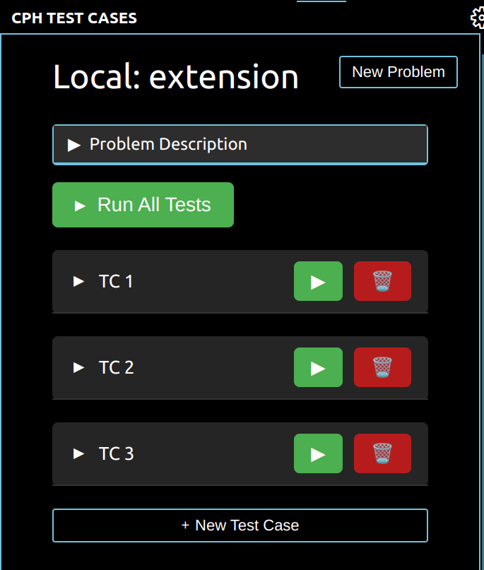
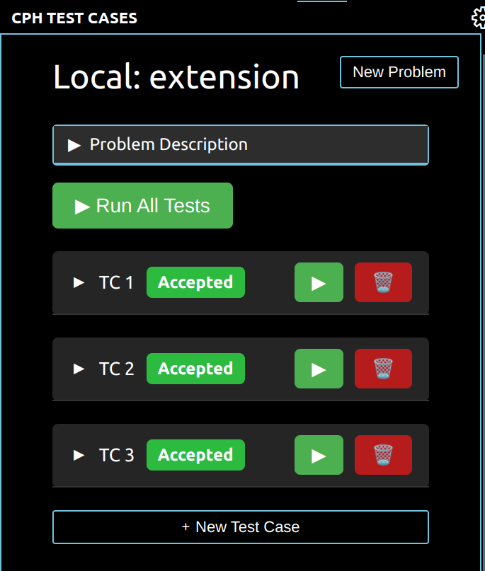

<p align="center">
  
  <h1 align="center">CPH-Leetcode</h1>
</p>

A VS Code extension that helps you test LeetCode problems directly in your development environment. Fetch test cases automatically and run them without leaving your editor.


## Features

- 🔄 Automatically fetch test cases from LeetCode problems
- ⚡ Run test cases directly in VS Code
- 📝 Support for multiple programming languages
- 🎯 Real-time test case validation
- 💻 Local development environment integration

<p align="center">
  &nbsp;&nbsp;
  
</p>

## Installation

### Method 1: VS Code Marketplace

1. Open VS Code
2. Go to Extensions (Ctrl+Shift+X)
3. Search for "Competitive Programming Helper LeetCode"
4. Click Install

### Method 2: Manual Installation
```bash
git clone https://github.com/your-username/cph-leetcode
cd cph-leetcode
npm install
npm run compile
```
## Supported Languages
- C++
- Python
- Java
- JavaScript

## Usage

1. Open a LeetCode problem in your browser
2. Copy the problem URL
3. In VS Code, use the command palette (Ctrl+Shift+P) and search for "CPH: Fetch Test Cases"
4. Paste the LeetCode URL when prompted
5. Test cases will be automatically fetched and ready to use
6. Write your solution and run tests using the CPH Test Runner

## Commands

- `CPH: Fetch Test Cases` - Fetch test cases from LeetCode URL
- `CPH: Run Test Cases` - Run current file against fetched test cases

## Requirements

- VS Code 1.96.0 or higher
- Node.js 22.10.0 or higher
- Active internet connection for fetching test cases

## Contributing

Contributions are welcome! Please feel free to submit a Pull Request.

1. Fork the repository
2. Create your feature branch (`git checkout -b feature/AmazingFeature`)
3. Commit your changes (`git commit -m 'Add some AmazingFeature'`)
4. Push to the branch (`git push origin feature/AmazingFeature`)
5. Open a Pull Request

## License

This project is licensed under the MIT License - see the [LICENSE](LISCENSE) file for details.
<hr>

~ Made with ❤️ for competitive programmers
